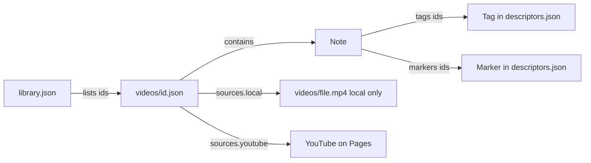
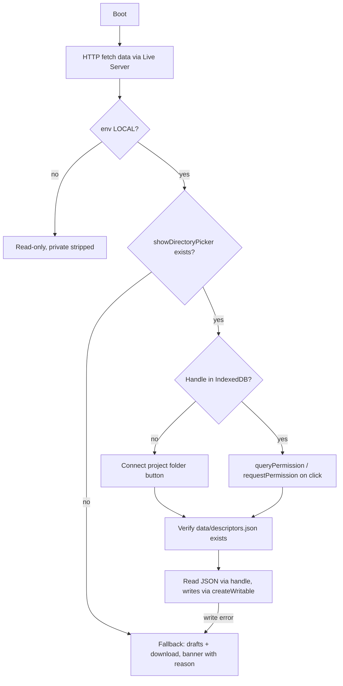
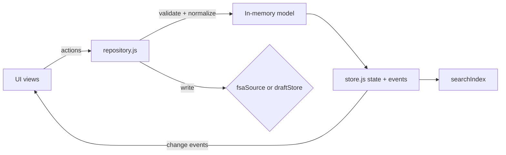

# Local-First Video Annotator: Implementation Plan

## 0. Findings and decisions so far

- The repo `videoAnnotator/` is empty apart from `.git`. It sits inside another project (`arduinoSorting`, a Next.js app), but the two don't share anything.
- **Videos:** your 3-4 GB files can't go to GitHub. A single file over 100 MB is rejected, and Pages sites are limited to about 1 GB. Each video therefore gets two sources:
  - a local file in `videos/`, which is git-ignored;
  - a YouTube ID.
- Locally, the app plays the file. On Pages it plays YouTube. If the local file is missing, the local app also falls back to YouTube. Timestamps are shared between the two, with an optional `offsetSeconds` in case the uploads differ.
- **Local runner:** the Live Server extension. Opening the page with `file://` won't work, because Chrome blocks `fetch()` and ES modules there.
- **Browsers:** Chrome and Edge get full direct saving. The Cursor/VS Code internal browser probably doesn't expose `showDirectoryPicker`, which is why the fallback matters:
  - The app shows a banner with the exact reason, for example `showDirectoryPicker is not available in this browser`, or the thrown `NotAllowedError: ...` message.
  - It keeps your edits as drafts.
  - It offers to download the changed JSON files.
- **Stack:** vanilla HTML, CSS and JS with native ES modules. There is no build step, no npm dependencies, and no framework. The YouTube IFrame API is the only external script, and it only loads when a YouTube source is used.

## 1. Project structure

```text
/
├── index.html                 single page, hash router
├── .nojekyll                  Pages serves files as-is
├── .gitignore                 videos/* except .gitkeep
├── .vscode/settings.json      Live Server: ignore data/** and videos/** (prevents reload on save)
├── README.md                  run, edit, deploy, remove sample data, fallback steps
├── css/
│   ├── tokens.css             colors, spacing, radii, motion
│   ├── base.css  layout.css  components.css  player.css  views.css
├── js/
│   ├── main.js                boot: env -> repository.load -> router.start
│   ├── config.js              overridable env rules, custom domains, defaults
│   ├── core/   env.js  store.js  router.js  dom.js(h(), safe text)  time.js  ids.js
│   ├── data/   schema.js(defaults/normalize)  validate.js  repository.js  visibility.js
│   ├── storage/ httpSource.js  fsaSource.js  handleStore.js(IndexedDB)  draftStore.js  exporter.js
│   ├── player/ playerShell.js  controls.js  sourceResolver.js  jumpHistory.js  fullscreen.js
│   │   └── adapters/ html5Adapter.js  youtubeAdapter.js
│   ├── features/
│   │   ├── library/     libraryView.js  addVideoDialog.js  editVideoDialog.js  youtubeUrl.js
│   │   ├── video/       videoView.js  videoHeader.js
│   │   ├── notes/       notesPanel.js  noteItem.js  noteEditor.js
│   │   ├── descriptors/ chips.js  descriptorPicker.js  descriptorManager.js
│   │   ├── search/      searchIndex.js  filters.js  searchView.js
│   │   ├── markers/     markerView.js
│   │   └── settings/    connectionPanel.js  issuesPanel.js
│   └── ui/     toast.js  modal.js  banner.js  icons.js
├── data/
│   ├── library.json           ordered list of video ids (static hosts cannot list folders)
│   ├── descriptors.json       global tags + markers
│   └── videos/
│       ├── sample-bbb.json
│       └── sample-sintel.json
└── videos/.gitkeep            your large local files live here (not committed)
```

All paths are relative (`./data/...`), so the site works under `https://<user>.github.io/<repo>/`.

## 2. JSON schemas (schemaVersion 1)

**`data/library.json`**

```json
{ "schemaVersion": 1, "videos": ["sample-bbb", "sample-sintel"] }
```

**`data/descriptors.json`**

```json
{
  "schemaVersion": 1,
  "tags": [
    { "id": "important", "name": "Important", "color": "#4f7cff", "description": "" }
  ],
  "markers": [
    { "id": "first-watch", "name": "First Watch", "description": "", "date": "2026-04-01", "order": 1 }
  ]
}
```

**`data/videos/<id>.json`**

```json
{
  "schemaVersion": 1,
  "id": "sample-bbb",
  "title": "Big Buck Bunny",
  "description": "Multi-paragraph text.\n\nSecond paragraph.",
  "visibility": "public",
  "sources": { "local": "videos/big-buck-bunny.mp4", "youtube": "aqz-KE-bpKQ", "offsetSeconds": 0 },
  "duration": 596,
  "createdAt": "2026-10-07T19:00:00Z",
  "updatedAt": "2026-10-07T19:00:00Z",
  "notes": [
    {
      "id": "n_k3j9x2",
      "type": "timestamp",
      "timestamp": 743.2,
      "title": "",
      "content": "Plain text, blank lines = paragraphs.",
      "tags": ["important", "question"],
      "markers": ["first-watch"],
      "visibility": "private",
      "createdAt": "...",
      "updatedAt": "..."
    }
  ]
}
```

**Field rules and relationships**

- Notes reference tags and markers by `id` only, so renaming a tag or marker never touches the video files.
- `type: "generic"` means `timestamp: null`.
- `title` is optional and mainly useful for generic notes.
- `visibility` defaults to `"public"` for both notes and videos.
- A private video is hidden entirely on Pages.
- `duration` is a cached value from the player, used for library display.
- Note content is plain text, rendered safely with paragraphs and URLs turned into links. There is no raw HTML.
- Files are written with `JSON.stringify(obj, null, 2)` and a stable key order, which keeps git diffs clean.



## 3. Environment detection (`js/core/env.js`)

Detection runs once at boot and produces a frozen object. It is the only place that reads `location`.

- **`LOCAL`:** protocol `file:`; hostname `localhost`, `127.0.0.1` or `[::1]`; `*.local`; or private LAN ranges (`10.*`, `192.168.*`, `172.16-31.*`).
- **`PUBLIC`:** `*.github.io`, plus any custom domains listed in `config.js`.
- **Unknown host:** treated as `PUBLIC`, so the safe read-only default applies.
- **Override:** adding `?env=public` to a local URL previews exactly what Pages visitors will see.

The rules live in `config.js` as an ordered list of `{ test, env }`, so you can extend them later.

Three pieces of state are derived from this. They are all exposed from `store`, and the UI never re-checks the hostname.

- `env`: `LOCAL` or `PUBLIC`
- `uiMode`: `edit` or `view`. This only applies in `LOCAL` and is remembered in `localStorage`.
- `persistence`: `fsa-connected`, `fsa-needs-permission`, `fallback(reason)` or `none-public`

Two helpers are derived from those: `canEdit()`, which is `env === LOCAL && uiMode === edit`, and `showPrivate()`, which is true only for `env === LOCAL`.

## 4. Local file access architecture



- **Opening the folder:** you click "Connect project folder" and choose the `videoAnnotator` folder.
  - The app checks the folder by looking for `data/descriptors.json`.
  - The handle is stored in IndexedDB.
  - On later visits, one click calls `requestPermission`. Recent Chrome versions also offer "Allow on every visit".
- **Loading:**
  - Data is always readable over HTTP first, so the viewer works before you connect.
  - Once connected, files are re-read through the handle so the app edits what is actually on disk.
- **Saving:**
  - Each logical change writes only the affected file: one video JSON, `descriptors.json`, or `library.json`.
  - The write uses `createWritable()`, then `write()`, then `close()`. Chrome commits the file atomically on close.
  - Writes go through a queue per file, so they never overlap.
  - Before writing, the app compares the file's `lastModified` with when it was loaded. If the file changed on disk, you get a prompt to reload or overwrite.
- **Live Server reload problem:** Live Server reloads the page whenever a file changes. `.vscode/settings.json` sets `liveServer.settings.ignoreFiles: ["data/**", "videos/**"]` to prevent that. The README documents this setting.
- **Fallback, used when the API is missing or any read/write throws:**
  - A persistent banner shows the exact error name and message, plus a hint such as "Open http://127.0.0.1:5500 in Chrome or Edge for direct saving".
  - Edits continue into `draftStore` in `localStorage`, so a reload doesn't lose them. This is a backup only; the JSON files stay the source of truth.
  - A "Unsaved: 2 files" pill opens the export panel. Each changed file has a Download button and its target path, such as `data/videos/sample-bbb.json`.
  - A draft clears itself once the file loaded over HTTP matches it, which means you replaced the file.
- **On Pages:** `fsaSource.js` is never imported (it is loaded with a dynamic `import()` only when `LOCAL`). `repository.save()` also throws if `!canEdit()`, which is a second guard.

## 5. Video discovery and adding videos

- **Existing videos:** `library.json` is the registry, because neither a static host nor Live Server can list folders through `fetch`.
  - When connected, the app also scans `videos/` through the directory handle.
  - Media files with no matching JSON appear in the Library under "Unregistered files", each with a "Register" action.
- **Adding a video:** the dialog is available in local edit mode and has three source options.
  1. Pick from unregistered files already in `videos/`. This is the recommended way for multi-GB files: copy them in with Explorer first.
  2. Pick a file from elsewhere, and the app copies it into `videos/` by streaming `file.stream().pipeTo(writable)` with a progress bar and a cancel button. This works, but takes a while for 4 GB.
  3. A YouTube URL or ID only, which is parsed into an ID.
- **After choosing a source:** you enter title, description, visibility and a **Backup YouTube link**. The app then:
  - creates `data/videos/<slug>.json`;
  - appends the id to `library.json`;
  - caches `duration` the first time the video plays.
- **Backup YouTube link field** (in both the Add and Edit dialogs):
  - Optional when a local file is chosen, and labeled "Backup YouTube link (used when the local file can't play, and on the public site)".
  - Accepts full URLs (`youtube.com/watch?v=`, `youtu.be/`, `/shorts/`, `/embed/`, with or without `&t=`) or a bare 11-character ID. The URL is parsed into `sources.youtube`.
  - Shows the YouTube thumbnail right away as a preview, so you can confirm it's the right video, plus a "Test" button that plays the video in the dialog.
  - An "Offset (seconds)" field next to it fills `sources.offsetSeconds` for uploads that start at a different point.
  - If there's no backup link and no local file, the dialog won't save.
  - If a video has only a local file, the library marks it "No backup link: hidden on the public site".
- **Editing a video** (new `editVideoDialog.js`, opened with an "Edit video" button in the video header, local edit mode only):
  - Uses the same form as Add: title, description, visibility, local file (pick or re-pick from `videos/`), backup YouTube link and offset.
  - Saving writes only that video's JSON. If the source changed, the player reloads at the same time position.
  - It includes a "Remove from library" action. This removes the entry from `library.json` and deletes the video's JSON, with a confirmation. It never deletes the video file itself.
- **Adding a video in fallback mode:** the same dialog generates both JSON files for download, with instructions on where to place them.

## 6. Video player architecture

The player is split into a shell and adapters.

- `playerShell.js` owns the custom controls and works against one adapter interface:
  - `play()`, `pause()`, `seek(t)`, `getTime()`, `getDuration()`, `setVolume()`, `setMuted()`, `setRate()`, `getRates()`
  - events: `ready`, `time`, `play`, `pause`, `ended`, `error`
- **`html5Adapter`:** wraps `<video>`. Live Server supports HTTP Range requests, so seeking in 4 GB files works without downloading them.
- **`youtubeAdapter`:**
  - Uses the IFrame API with `controls=0`, `modestbranding`, `rel=0` and `playsinline`.
  - Polls time every 250 ms.
  - A transparent click layer handles play/pause, because clicks inside the iframe are otherwise swallowed.
  - `offsetSeconds` is applied here.
- **`sourceResolver`:**
  - On `LOCAL`, it tries `sources.local` first. It switches to the backup YouTube link in any of these cases:
    - there is no local path;
    - the `<video>` fires `error` (file missing or unsupported codec);
    - the video stalls before `loadedmetadata` for about 8 s, for example an OneDrive placeholder that isn't downloaded.
  - When it switches, the current time is kept, adjusted by `offsetSeconds`. A small notice explains why, for example "Local file couldn't load (MEDIA_ERR_SRC_NOT_SUPPORTED). Playing the YouTube backup."
  - A source switch in the controls ("Local file" or "YouTube") lets you change sources by hand at any time, keeping the position. It's useful for checking that both versions line up.
  - If both sources fail, the player shows the exact errors and an "Edit video" shortcut.
  - On `PUBLIC`, it uses YouTube. If there is no YouTube source, it shows "Available locally only".
- **Controls:**
  - play/pause, seek bar with buffered range and hover time preview
  - **note ticks on the seek bar**, colored by each note's first tag; clicking a tick jumps to that note
  - current time / duration, volume and mute, speed (0.5-2x, or YouTube's available rates)
  - Go Back, Add timestamp note, fullscreen
  - The controls auto-hide during playback.
- **Keyboard shortcuts:** Space or K for play/pause, J and L for -10/+10 s, arrow keys for ±5 s, `N` for a timestamp note, `G` for a generic note, `B` for Go Back, `F` for fullscreen, `M` for mute, `/` for search. Shortcuts are ignored while you type.
- **Fullscreen:**
  - `requestFullscreen()` targets the **player shell container**, not the `<video>`, so custom controls and a slide-in quick-note panel stay usable. This works for both HTML5 and the YouTube iframe.
  - Where `document.fullscreenEnabled` is false (iPhone Safari, and possibly embedded browsers), the button becomes **Theater mode**, a CSS viewport fill that keeps the same overlay.
  - Fullscreen is a progressive enhancement and never the only way to do anything.

## 7. Timestamp navigation (`jumpHistory.js`)

- The history is a stack of positions, capped at 20 and cleared when you switch videos.
- When you jump to a note, a search result or a tick mark:
  - the current time is pushed onto the stack, unless it is within 2 s of the target;
  - then the player seeks.
- A "Back to 18:21" pill appears beside the controls. Clicking it, or pressing `B`, pops the stack and seeks back.
- The pill hides when the stack is empty.
- Normal scrubbing does not push history. Only deliberate jumps do.
- A deep link such as `#/video/sample-bbb?t=743` seeks on load.

## 8. UI and component architecture

Routing uses the URL hash, which works on Pages with no 404 tricks:

- `#/`: the library
- `#/video/:id?t=&note=`: a video page
- `#/search?q=&tag=&marker=...`: search with filters
- `#/markers` and `#/markers/:id`: marker browsing

Rendering uses a small `h()` helper. Each view re-renders only its own region when it receives a store event. There is no virtual DOM.

- **Top bar** (slim):
  - wordmark that links to the library, and the global search field
  - environment badge: `Local · Editing`, `Local · View` or `Public`
  - Edit/View toggle (local only)
  - connection status button, which opens the Settings panel
- **Library:** a responsive grid of 16:9 thumbnails, using YouTube thumbnails or a generated gradient with the title.
  - Each tile shows title, duration and note count, with a hover lift.
  - Below the grid: a "Browse by marker" row, unregistered files, and Add video (edit mode only).
- **Video page:**
  - The player spans the full width, with height up to about 78vh. When the editor opens, it eases down to about 62vh. It never gets small.
  - Below it are the title and a collapsible multi-paragraph description.
  - The lower area has two columns on wide screens. The **Notes panel** has Timeline and General tabs, local tag/marker filter chips, and a "now playing" highlight that follows the current time. The **Editor drawer** sits on the right.
  - Below about 1000 px, the editor becomes a bottom sheet and the notes stack under the video.
- **Note editor (drawer):**
  - Opens through "+ Timestamp" (current time prefilled and editable, accepting `12:43`, `1:02:03` or seconds), "+ General note", or clicking any note.
  - Fields: an auto-growing textarea, a tag combobox with "Create tag 'x'" inline, a marker combobox, a Public/Private segmented control, and an optional title.
  - The marker picker remembers your last-used marker as the default for the session, which suits "First Watch" style use.
  - Optional "pause while typing", on by default.
  - Ctrl+Enter saves. Delete removes the note right away and shows an **Undo** toast for 6 s before the file write is final.
- **Chips:**
  - Tags are filled pills tinted with their color.
  - Markers are outlined pills with a flag icon in neutral or blue, so they read differently from tags.
  - Private notes get a lock icon and a dashed left border labeled "Local only".
- **Descriptor manager (modal):**
  - Lists tags and markers with usage counts.
  - Supports rename, a color picker (native `input[type=color]` plus curated swatches that look good on dark backgrounds), description, and marker date/order.
  - Deleting a tag or marker in use asks you to choose: remove it from all notes (writes every affected video file) or keep the references as orphans.
- **Search view:** described in section 9.
- **Markers view:** a list of markers with counts. Selecting one shows its notes across all videos, grouped by video, showing timestamp, content snippet, tags and marker.
- **Settings panel:**
  - folder connection status, reconnect, and the fallback reason
  - drafts and export
  - a Data Issues list
  - a "Preview public site" link (`?env=public`)
- **Theme:**
  - Background `#0e1014`, surfaces `#15181e` and `#1b1f27`, borders `#262b35`, text `#e6e8ee` and `#9aa3b2`.
  - Deep blue accent `#2f5bd3`, hover `#3b6cf0`, focus ring `#5b8cff`.
  - Transitions of 150-220 ms. `prefers-reduced-motion` is respected.

## 9. Search and filter architecture

- **`searchIndex.js`:**
  - Built once after load, and rebuilt incrementally for one video when it changes.
  - Holds flat documents, with one per video (title, description) and one per note. Each note document stores `videoId`, `noteId`, `type`, `timestamp`, `content`, `title`, tag names and marker names.
  - Text is normalized: lowercase, accents stripped, and split into words.
  - Matching requires every query term to appear in some field.
  - Scoring weights: title 5, tag/marker name 3, content 1. Matched words are highlighted.
  - The dataset is small, so there is no search library.
- **`filters.js`:** a registry of `{ id, label, getOptions(state), predicate(doc, value) }`.
  - Initial filters: video, type (video, timestamp note, generic note), tag, marker, visibility (local only).
  - Filters combine with AND. Multi-select within one filter uses OR.
  - Adding a filter means adding one entry to the registry.
- **Results:**
  - Grouped by video, each group headed by the video title and thumbnail.
  - Each row shows the timestamp, a snippet and chips.
  - Clicking a row navigates to `#/video/:id?t=..&note=..`, which seeks and briefly highlights the note.
- Search state lives in the URL, so it survives reloads and links can be shared.

## 10. Public and private behavior

- **Centralized in `data/visibility.js`:** it is applied **inside `repository.load()`** when `!showPrivate()`. Private notes and private videos are removed from the in-memory model before any UI, search index, marker view or tick-mark code sees them, so no part of the app can forget to filter.
- In `LOCAL`, nothing is stripped, and private items are visually labeled.
- The README and a small footer note in Settings state plainly that private notes are **hidden, not secret**. They still exist in the public JSON files. There is no encryption.
- If you need real secrecy, the documented option is keeping such notes in a git-ignored file. That is outside this plan's scope.

## 11. State and data flow



- `store.js` is about 60 lines. It holds `{ env, uiMode, persistence, descriptors, videos: Map, issues, ui }` plus `subscribe(event, fn)` and `set()`.
- Only `repository.js` changes data. Every action, such as `saveNote` or `deleteNote`, follows the same sequence:
  1. validate;
  2. update the model;
  3. emit an event;
  4. persist;
  5. show a "Saved" toast, or on failure an error banner and a draft.
- The UI never touches storage directly. Data modules never touch the DOM.

## 12. Validation and error handling

Validation happens per file and per note in `validate.js`. One bad note never breaks a video, and one bad video never breaks the library.

- **Missing or invalid `library.json` / `descriptors.json`:** the app shows a full-page error explaining which file failed, the parse error and its line, and how to fix it. Descriptors fall back to empty lists, so videos still load.
- **Missing or invalid video JSON:** that tile shows "Couldn't load data/videos/x.json: <reason>". Everything else works.
- **Missing video file:** the player falls back to YouTube, or shows a "Video file not found: videos/x.mp4" placeholder.
- **Unsupported codec:** explained by the player error. Chrome plays H.264/AAC MP4 and VP9/AV1 WebM, but HEVC or some MKV audio may fail.
- **Unknown or deleted tag/marker reference:** shown as a gray "unknown: id" chip locally and hidden on Pages. The reference is kept and listed in Data Issues.
- **Duplicate IDs:**
  - Duplicate notes get a new id in memory, which is flagged and written out on the next save.
  - A duplicate video id in `library.json` is ignored after the first occurrence and flagged.
- **Malformed timestamps:** strings like `"12:43"` are converted. Negative or unparsable values turn the note into a flagged generic note in the UI, while its original value is kept.
- **Data preservation:** notes that can't be repaired are kept in a quarantine list and **written back unchanged** on save, so data you can't see is never silently deleted.
- **Unknown fields:** passed through untouched, so the format can grow later.

## 13. Browser limitations and how they're handled

- **File System Access API:** Chrome and Edge only, and it requires a secure context (`localhost`/`127.0.0.1` count as one). Writing requires one click to grant permission each session. Other browsers and embedded browsers get the explained fallback.
- **`file://`:** blocks fetch and modules, so the site needs Live Server. The README says this, and if the app does load from `file:`, it shows an explanatory screen.
- **Folder listing:** static hosts can't list folders. `library.json` acts as the registry, and the folder scan only runs when connected.
- **Copying into the project:** the browser can only write into the folder you chose. Large copies stream with progress. Dropping files in Explorer is recommended.
- **GitHub Pages:** static only, with a file limit of 100 MB and a site limit of about 1 GB. Videos come from YouTube, and the app never writes on Pages.
- **Fullscreen:** element fullscreen works on desktop and Android. iPhone Safari gets Theater mode. YouTube iframes inside a fullscreened container work.
- **YouTube:** the branding and the pause overlay can't be fully removed. Embedding must be enabled on the video. Unlisted videos work for semi-private sharing.
- **CORS:** the app only makes same-origin requests for JSON and video, plus the YouTube iframe, so there are no CORS issues. It does not draw frames from YouTube videos to make thumbnails (not possible across origins); it uses `img.youtube.com` thumbnails instead.

## 14. Sample data

- Two videos, using Blender open movies so they're legally fine:
  - Big Buck Bunny and Sintel, with YouTube IDs to be checked during implementation;
  - optional local file names, documented with download links.
- 6 tags: Important, Question, Interesting, Funny, Problem, Tutorial.
- 4 markers: First Watch, Second Watch, April 2026, October 2026.
- About 12 notes in total: timestamp and generic, public and private, some with several tags, some with markers.
- All sample files are prefixed `sample-`. The README explains removal in two steps: delete the files and clear `library.json`.

## 15. Risks

- **OneDrive:** the project folder is under OneDrive, so 3-4 GB files in `videos/` would sync to the cloud, and "Files On-Demand" placeholders may not stream. To handle this, an optional **"External videos folder"** setting can connect a second folder handle (for example `D:\Videos`) and play files through `URL.createObjectURL(file)`. That needs no copying and no syncing, and it is scheduled for Phase 7.
- **Cursor's internal browser:** it will most likely run in fallback mode. Recommended workflow: edit in Chrome at the Live Server URL, and preview anywhere.
- **Live Server reload:** if the ignore setting is missing, every save reloads the page. The app warns about this by detecting the reload during a save.
- **YouTube and local files out of sync:** if the two versions differ, timestamps drift. `offsetSeconds` handles this for each video.
- **Slow first load of big local videos:** if the MP4's index is at the end of the file, metadata loads slowly. The README suggests `ffmpeg -movflags +faststart`.
- **External edits to the JSON:** handled by the `lastModified` check before every write.
